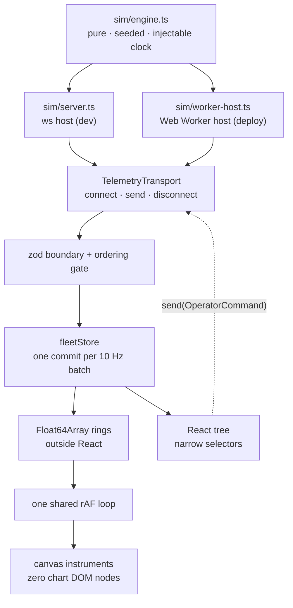

# Fleet Console

A fleet-operations console for home humanoid robots. Eight units on a map,
joint telemetry at 10 Hz, and one incident that walks an operator from a
glance to a named failed part. A design and engineering demo; all data is
simulated.

**[Live demo →](https://fleet-console.pages.dev)** — a static build with the
simulator in a Web Worker. Nothing to wake up.


[Watch it as video (54 s, MP4)](docs/evidence/golden-path.mp4)

## What to watch for

Open the demo and leave it running. Timings are from page load.

1. **0:20** — `TRENDING` ticks to 1. N-07's rail row names its suspect
   (_left knee +18 °C/min_) while the unit still reads nominal. That is a
   least-squares fit over fifteen seconds of joint temperature, not a
   threshold.
2. **0:28** — N-07 goes `ATTENTION`; the map marker and the alert feed
   react in the same frame batch. **0:38** — it goes red.
3. **Click N-07.** Eighteen canvas instruments; the left knee's three traces
   are the only warm thing on the page. **Press Run diagnostic.**
4. **The descent.** The page drains, a black surface wipes up, and the type
   boots in phosphor mono. Fifteen seconds later the verdict reads
   `KNEE_L · ACTUATOR A-07 — GAIN ANOMALY`, with the evidence underneath it.
5. **Press Command safe sit, then CONFIRM.** The narration arrives from the
   wire — `GAIT ARRESTED` → `POSTURE SETTLED` — and N-07 stays red, because
   broken-but-safe is the honest state.
6. **ESC.** Operator space returns with the incident on file. Press the
   `INC-N07-…` reference for the report a technician would be handed.

Two more storylines share the same clock: N-03 halts on a blocked route at
2:00 and recovers itself, and from 3:00 four units raise the same warning on
the same firmware, with a rollout to halt and a cohort to roll back. They are
described in [docs/walkthrough.md](docs/walkthrough.md). _Reset simulation_
in the footer replays everything from the same seed.

## Two worlds

**Operator space** is warm white, Geist Sans, wide-tracked small-caps labels,
pill buttons, muted sage/amber/clay. The surface you glance at like a
thermostat. **Machine space** is what the robot says about itself: phosphor
mono on near-black, radius zero, hierarchy by luminance. Crossing between them
is the whole interaction, and no component takes a `space` prop — both worlds
are one semantic token layer resolved twice, under `[data-space]`.
[`/system`](https://fleet-console.pages.dev/system) renders the library in
both.

## Architecture



- **One transport interface, two implementations.** `WsTransport` speaks to
  a `ws` server in development; `WorkerTransport` runs the identical engine in
  a Web Worker for the static deploy. A test pins the two streams
  byte-identical, which is what lets Playwright test the artifact that ships.
- **10 Hz costs one commit and one render.** Samples land in ring buffers
  React does not own; the store bumps one version per batch; canvas hosts
  read the rings in the frame loop and skip the draw when nothing arrived.
- **Delivery is treated as hostile at the boundary that already validates.**
  Stale telemetry is dropped whole, command events order by an engine
  sequence, and a snapshot resets every gate.
- **The console never animates a maneuver the robot has not agreed to.**
  Recommendations are split by data: one executes, the others record, and
  `Disable joint` is inert until the unit is seated. Confirmations open with
  ABORT focused; refusals print in the machine's own words.
- **Privacy is modelled, not mentioned.** Home positions are quantized to a
  ~500 m grid and the map zoom is capped below street level.
- **The component boundary is enforced by lint.** `@/components/console` is
  the only door to shadcn; a `no-restricted-imports` rule fails the build if
  app code reaches past it.

## Receipts

Measured on the static export, the exact artifact that deploys. The budget
check runs at the end of every `pnpm e2e` and CI posts the table to the job
summary; the numbers below are copied from that output.

| Budget                                   | Measured                                 | Verdict |
| ---------------------------------------- | ---------------------------------------- | ------- |
| Fleet page initial JS < 200 KB gz        | **180.5 KB**                             | PASS    |
| Unit page initial JS < 200 KB gz         | **188.7 KB**                             | PASS    |
| 60 fps during the descent                | p95 frame 9.2 ms, 1 of 974 over 16.7 ms  | PASS    |
| Interaction latency < 100 ms             | Run-diagnostic press → feedback 1.3 ms   | PASS    |
| Component view (three + GLB) < 500 KB gz | 321.7 KB, lazy                           | PASS    |
| 500 units                                | ~5,000 batches/s, 13.4 µs/msg, p95 10 ms | PASS    |

Lazy bundles: maplibre (268.6 KB gz) on fleet-page mount, machine space
(56.1 KB gz) warmed by the incident banner, three + R3F (249.4 KB gz) on
scroll approach. Details and method in [docs/perf.md](docs/perf.md).

## Component library

`@/components/console` wraps shadcn's Radix behaviour and re-themes it; every
component renders in both spaces without being told which one it is in.

| Component        | What it is                                                                                                     |
| ---------------- | -------------------------------------------------------------------------------------------------------------- |
| `StatusChip`     | A quiet tinted pill in operator space, an inverted `OPERATING`/`DAMAGED` block in machine space. Same element. |
| `UnitCard`       | One home in the fleet as a fixed-height row; pure, so the rail subscribes per row.                             |
| `FleetRail`      | The virtualized unit list. Eight units today, the same code at eight hundred.                                  |
| `AlertRail`      | The feed. Newest first, deduped, capped, and the only region allowed to raise its voice.                       |
| `FleetMap`       | MapLibre behind a dynamic boundary; marker DOM is mutated imperatively, never reconciled.                      |
| `TelemetryStrip` | One joint, one measure, as a canvas instrument on the shared frame loop.                                       |
| `StatusTimeline` | The session as one band: has this unit been fine, and when did that stop.                                      |
| `IncidentBanner` | The one loud object in operator space. Holds the single primary action.                                        |
| `DescentOverlay` | The gate: decides when the descent may begin, drains the page, mounts machine space lazily.                    |
| `ComponentView`  | The 3D chassis behind its own dynamic boundary.                                                                |

Machine space lives in `components/machine` and is not re-exported from the
barrel, so it never rides in the unit page's initial JS: `ScanLog`,
`WaveformDeck`, `StatusBoard` + `PartsManifest`, and `VerdictCard`.

## Testing

`pnpm test` runs the vitest suite: console components, both stores' reducers
and guard rails, the transports against injected sockets and workers, the
ordering gate under scripted disorder, and the sim engine's determinism and
choreography. `pnpm e2e` builds the static export and runs five Playwright
projects against it — the golden path, leave-and-return, the firmware cohort,
the phone at 390 px, and reduced motion at both viewports — then checks the
bundle budgets. CI runs lint, typecheck, unit, e2e and budgets on every push.

## Run it

```bash
pnpm install
pnpm sim      # ws simulator on :8787
pnpm dev      # http://localhost:3000
```

`pnpm build:static` emits `out/` with the simulator in a Web Worker; that is
what the live demo serves.

---

A design and engineering demo. All data is simulated. MIT licensed.
