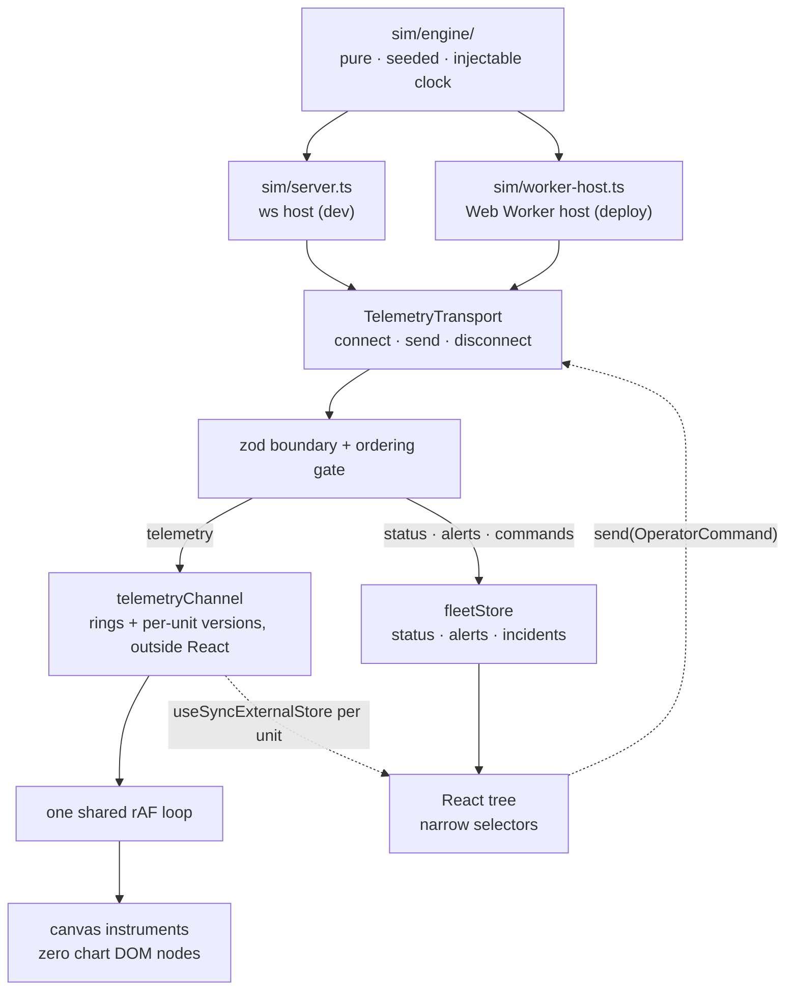

# Fleet Console

[](https://github.com/jonathanhawkins/fleet-console/actions/workflows/ci.yml)

A fleet-operations console for home humanoid robots. Eight units on a map,
joint telemetry at 10 Hz, and one incident that walks an operator from a
glance to a named failed part. A design and engineering demo; all data is
simulated.

**[Live demo →](https://fleet-console.pages.dev)** — a static build with the
simulator in a Web Worker. Nothing to wake up.


[Watch it as video (54 s, MP4)](docs/evidence/golden-path.mp4)

## What to watch for

Open the demo and leave it running. Timings are from page load.

1. **0:20** — `TRENDING` ticks to 1. N-07's rail row names its suspect
   (_left knee +18 °C/min_) while the unit still reads nominal. That is a
   least-squares fit over fifteen seconds of joint temperature, not a
   threshold.
2. **0:28** — N-07 goes `ATTENTION`; the map marker and the alert feed
   react in the same frame batch. **0:38** — it goes red.
3. **Click N-07.** Eighteen canvas instruments; the left knee's three traces
   are the only warm thing on the page. **Press Run diagnostic.**
4. **The descent.** The page drains, a black surface wipes up, and the type
   boots in phosphor mono. Fifteen seconds later the verdict reads
   `KNEE_L · ACTUATOR A-07 — GAIN ANOMALY`, with the evidence underneath it.
5. **Press Command safe sit, then CONFIRM.** The narration arrives from the
   wire — `GAIT ARRESTED` → `POSTURE SETTLED` — and N-07 stays red, because
   broken-but-safe is the honest state.
6. **ESC.** Operator space returns with the incident on file. Press the
   `INC-N07-…` reference for the report a technician would be handed.

Three more storylines share the same clock: N-03 halts on a blocked route at
2:00 and recovers itself; from 3:00 four units raise the same warning on the
same firmware, with a rollout to halt and a cohort to roll back; and at 5:30
N-01 reports the one fault a recalibration genuinely fixes, so the same
command that came back `PARTIAL` on the knee clears it.

**You do not have to wait for them.** _Jump to_ in the footer — _Blocked
route_, _Firmware cohort_, _Ankle offset_ — replays the run from the top and
stops eight seconds short of that chapter, so the alert still arrives while
you are watching and the fleet still carries the history it would have had.
_Reset simulation_ starts over from the same seed. All four are described in
[docs/walkthrough.md](docs/walkthrough.md).

## Two worlds

**Operator space** is warm white, Geist Sans, wide-tracked small-caps labels,
pill buttons, muted sage/amber/clay. The surface you glance at like a
thermostat. **Machine space** is what the robot says about itself: phosphor
mono on near-black, radius zero, hierarchy by luminance. Crossing between them
is the whole interaction, and no component takes a `space` prop — both worlds
are one semantic token layer resolved twice, under `[data-space]`.
[`/system`](https://fleet-console.pages.dev/system) renders the library in
both.

## Architecture



- **One transport interface, two implementations.** `WsTransport` speaks to
  a `ws` server in development; `WorkerTransport` runs the identical engine in
  a Web Worker for the static deploy. A test pins the two streams
  byte-identical, which is what lets Playwright test the artifact that ships.
- **10 Hz of telemetry costs the store nothing.** Samples never enter
  reactive state: they land in `Float64Array` rings beside a per-unit version
  counter, and only that unit's subscribers are notified. Canvas hosts read the
  rings in the frame loop and skip the draw when nothing arrived. The store
  commits when a fact an operator reads changes, not when a sample does.
- **Delivery is treated as hostile at the boundary that already validates.**
  Stale telemetry is dropped whole, command events order by an engine
  sequence, and a snapshot resets every gate.
- **The console never animates a maneuver the robot has not agreed to.**
  Recommendations are split by data: one executes, the others record, and
  `Disable joint` is inert until the unit is seated. Confirmations open with
  ABORT focused; refusals print in the machine's own words.
- **Privacy is modelled, not mentioned.** Home positions are quantized to a
  ~500 m grid and the map zoom is capped below street level.
- **The component boundary is enforced by lint.** `@/components/console` is
  the only door to shadcn; a `no-restricted-imports` rule fails the build if
  app code reaches past it.

### If you only read four files

- **[lib/transport/workerTransport.ts](lib/transport/workerTransport.ts)** —
  the boundary. Where zod validates, where "open" is defined as the first
  message that parses rather than the first `postMessage`, and where a worker
  that never answers becomes a reported status instead of a hang.
- **[components/fleet/telemetry-strip/strip-draw.ts](components/fleet/telemetry-strip/strip-draw.ts)**
  — the hot path. Eighteen instruments, one rAF loop, ring buffers outside
  React, and a draw that skips entirely when no sample arrived.
- **[components/machine/wireframe-elevation.tsx](components/machine/wireframe-elevation.tsx)**
  — the descent's hardest surface: the robot's own extracted edge set,
  projected and bucketed onto a luminance ladder by arithmetic, no three.js,
  ~16 KB of JSON. Split into a model, a painter and a component.
- **[app/styles/tokens.css](app/styles/tokens.css)** — the two worlds. Every
  colour in the app resolves from here; nothing downstream knows which space
  it is in.

## Receipts

Measured on the static export, the exact artifact that deploys. The budget
check runs at the end of every `pnpm e2e` and CI posts the table to the job
summary; the numbers below are copied from that output.

| Budget                                   | Measured                                 | Verdict |
| ---------------------------------------- | ---------------------------------------- | ------- |
| Fleet page initial JS < 200 KB gz        | **183.2 KB**                             | PASS    |
| Unit page initial JS < 200 KB gz         | **192.2 KB**                             | PASS    |
| 60 fps during the descent                | p95 frame 9.2 ms, 1 of 974 over 16.7 ms  | PASS    |
| Interaction latency < 100 ms             | Run-diagnostic press → feedback 1.3 ms   | PASS    |
| Component view (three + GLB) < 500 KB gz | 321.7 KB, lazy                           | PASS    |
| 500 units                                | ~5,000 batches/s, 13.4 µs/msg, p95 10 ms | PASS    |

Lighthouse is a gate, not a quote: `node scripts/lighthouse.mjs` runs the
desktop preset against `/`, `/unit/N-01` and `/system` on the same export and
fails under performance 90 or any other category under 100. Accessibility,
best practices and SEO are **100** on all three, every run. Performance is 100
on `/` and `/system`, and moves between 98 and 100 on `/unit/N-01`, whose
eighteen live instruments put real work on the main thread at load: the same
build measured 445 ms of total blocking time on a busy machine and 52 ms on an
idle one. That is why the gate is 90 rather than 100 there, and why CI reports
performance instead of failing on it. `/system` is in the list because it is the only
route that renders machine space, so half the design thesis would otherwise
never be audited; adding it found three real defects on its first run. CI runs
the script after the budgets on every push, gating the three deterministic
categories and reporting performance, which on a shared runner measures the
runner more than the page. The full reports, cut on the hardware documented in
docs/perf.md, are the receipt —
[docs/evidence/lighthouse/index.json](docs/evidence/lighthouse/index.json)
[docs/evidence/lighthouse/unit-N-01.json](docs/evidence/lighthouse/unit-N-01.json)
and [docs/evidence/lighthouse/system.json](docs/evidence/lighthouse/system.json)
(load any of them in the Lighthouse Viewer).

Lazy bundles: maplibre (270.5 KB gz) on fleet-page mount, machine space
(56.1 KB gz) warmed by the incident banner, three + R3F (249.4 KB gz) on
scroll approach. Details and method in [docs/perf.md](docs/perf.md).

## Component library

Two folders, one direction of dependency. `@/components/console` is the
library: pure primitives and hooks that import nothing from the stores, wrap
shadcn's Radix behaviour, and render in both spaces without being told which
one they are in. `@/components/fleet` is this app: the store-wired regions built
out of those primitives. A lint rule enforces the direction — `console` may not
import `lib/stores` or `components/fleet` — so a primitive that grew a
subscription would fail the build rather than quietly become a region.

| Console primitive                 | What it is                                                                                                     |
| --------------------------------- | -------------------------------------------------------------------------------------------------------------- |
| `StatusChip`                      | A quiet tinted pill in operator space, an inverted `OPERATING`/`DAMAGED` block in machine space. Same element. |
| `ConsoleButton`                   | The one black pill per screen, and its quieter siblings; square and mono below the descent.                    |
| `ConsoleCard`                     | A surface separated by warmth and a hairline, never by weight.                                                 |
| `UnitCard`                        | One home in the fleet as a fixed-height row; pure, so the rail subscribes per row.                             |
| `BatteryMeter`                    | A charge level as a bar, not a gauge.                                                                          |
| `StatGroup`                       | A labelled figure that renders an em-dash, never an invented number, while pending.                            |
| `SectionLabel`                    | The wide-tracked small-caps label that names every region.                                                     |
| `ConsoleHeader` / `ConsoleFooter` | The shell: the typographic mark, and the disclaimer on every page.                                             |
| `registerFrame`                   | The one shared rAF loop every canvas instrument draws on.                                                      |

| Fleet region     | What it is                                                                                  |
| ---------------- | ------------------------------------------------------------------------------------------- |
| `FleetRail`      | The virtualized unit list. Eight units today, the same code at eight hundred.               |
| `AlertRail`      | The feed. Newest first, deduped, capped, and the only region allowed to raise its voice.    |
| `FleetMap`       | MapLibre behind a dynamic boundary; marker DOM is mutated imperatively, never reconciled.   |
| `TelemetryStrip` | One joint, one measure, as a canvas instrument on the shared frame loop.                    |
| `StatusTimeline` | The session as one band: has this unit been fine, and when did that stop.                   |
| `IncidentBanner` | The one loud object in operator space. Holds the single primary action.                     |
| `DescentOverlay` | The gate: decides when the descent may begin, drains the page, mounts machine space lazily. |
| `ComponentView`  | The 3D chassis behind its own dynamic boundary.                                             |
| `CohortCard`     | The fleet incident: four robots on one build, the halt, the staged rollback.                |

Machine space lives in `components/machine` and is not re-exported from either
barrel, so it never rides in the unit page's initial JS: `ScanLog`,
`WaveformDeck`, `StatusBoard` + `PartsManifest`, and `VerdictCard`.

## Testing

`pnpm test` runs the vitest suite — 1,528 specs across 99 files: console
components, both stores' reducers and guard rails, the transports against
injected sockets and workers, the ordering gate under scripted disorder, and
the sim engine's determinism and choreography. `pnpm e2e` builds the static
export and runs five Playwright projects against it — the golden path,
leave-and-return, the firmware cohort, the phone at 390 px, and reduced motion
at both viewports — then checks the bundle budgets. CI runs lint, typecheck,
unit, e2e and budgets on every push.

Accessibility is tested twice, because the two methods reach different places.
Lighthouse gates the three routes at rest. `e2e/accessibility.spec.ts` reaches
everything they cannot: it runs axe (WCAG 2 A/AA) on each surface the golden
path opens — the fleet with an alert on it, the descent mid-scan, the verdict,
the safe-sit confirm gate, the incident report — and then walks the same path
again using only the keyboard, asserting a visible focus ring at every stop in
both colour spaces. A 100 that never opened a dialog is a number about the easy
part.

## What this demo is not

Worth saying plainly, because each of these is a decision rather than an
oversight:

- **One operator, no identity.** The audit trail models who acted — every row
  carries an actor, and it distinguishes the three kinds that matter: the
  operator pressed something, the robot reported it, or a program ran to its
  own clock. What it cannot do is tell two operators apart, because there is no
  authentication to name them. A real deployment needs sign-in, per-user
  attribution and a handover between shifts; the actor field is the seam where
  that goes.
- **Nothing is durable past the tab.** A reload is handled — the storyline
  resumes where it left off and the incidents come back with it, out of
  `sessionStorage` — but that is one browser tab remembering one sitting, not
  persistence. Close the tab and the record is gone; open the demo on another
  machine and there is nothing to see. The incident report exists to be printed
  and handed on; behind it a real console needs a server that keeps it.
- **One third-party origin, and it is the pretty one.** The basemap's tiles
  come from `tiles.openfreemap.org` — the only external request the app makes.
  A network that blocks it, or a host having a slow morning, is handled rather
  than ignored: a 2.5 s timeout and MapLibre's own error both flip the map to a
  degraded state that keeps every marker, says `Base map unavailable. Fleet
positions are unaffected.`, and leaves the rail and the feed untouched — the
  cartography is the only thing missing, and `e2e/map-degraded.spec.ts` proves
  it with the host blocked. What it is not is a _fallback_: there is no bundled
  basemap, so a reviewer behind a strict proxy sees the fleet on a blank ground
  rather than on streets.
- **No fleet-scale write path.** Commands go to one unit at a time, except the
  firmware rollout, which is deliberately the exception that shows why
  fleet-scoped commands need their own confirmation and their own audit.

## Run it

```bash
pnpm install
pnpm sim      # ws simulator on :8791
pnpm dev      # http://localhost:3000
```

`pnpm build:static` emits `out/` with the simulator in a Web Worker; that is
what the live demo serves.

---

A design and engineering demo. All data is simulated. MIT licensed.
