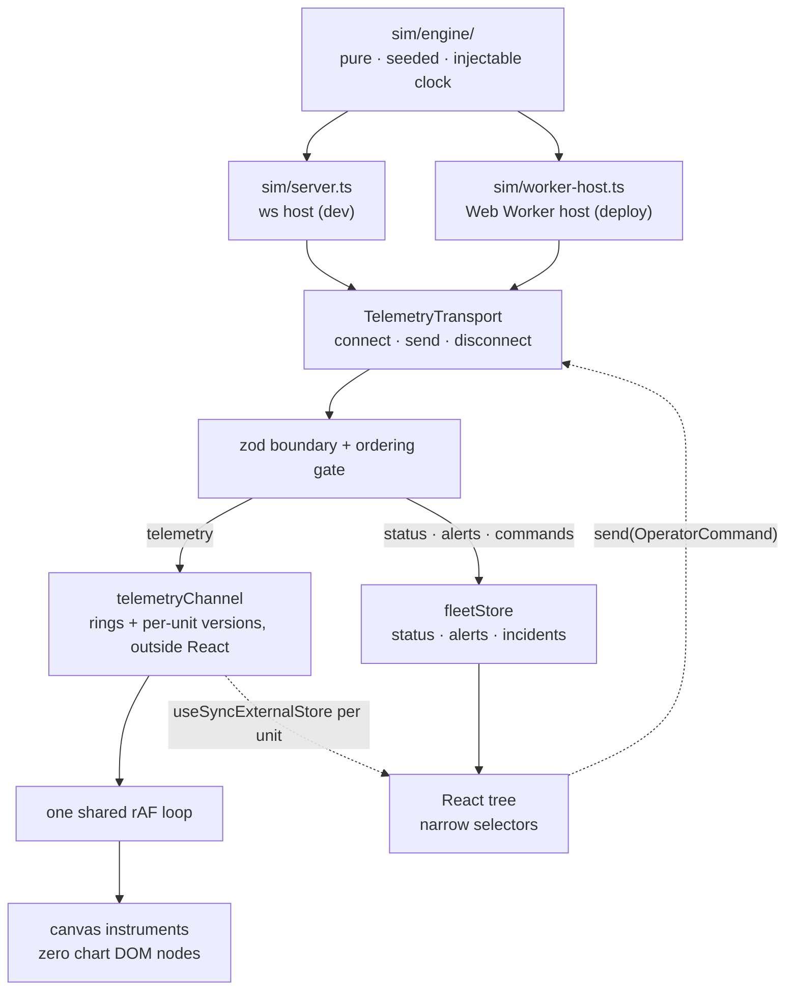

# Architecture

The detail behind the README's summary: how a sample gets from the engine to a
pixel, and what the two component folders are for.

- **One transport interface, two implementations.** `WsTransport` speaks to a
  `ws` server in development; `WorkerTransport` runs the identical engine in a
  Web Worker for the static deploy. A test pins the two streams byte-identical,
  which is what lets Playwright test the artifact that ships.
- **10 Hz of telemetry costs the store nothing.** Samples never enter reactive
  state: they land in `Float64Array` rings beside a per-unit version counter,
  and only that unit's subscribers are notified. Canvas hosts read the rings in
  the frame loop and skip the draw when nothing arrived. The store commits when
  a fact an operator reads changes, not when a sample does.
- **Delivery is treated as hostile at the boundary that already validates.**
  Stale telemetry is dropped whole, command events order by an engine sequence,
  and a snapshot resets every gate.
- **The console never animates a maneuver the robot has not agreed to.**
  Recommendations are split by data: one executes, the others record, and
  `Disable joint` is inert until the unit is seated. Confirmations open with
  ABORT focused; refusals print in the machine's own words.
- **Privacy is modelled, not mentioned.** Home positions are quantized to a
  ~500 m grid and the map zoom is capped below street level.
- **The component boundary is enforced by lint.** `@/components/console` is the
  only door to shadcn; a `no-restricted-imports` rule fails the build if app
  code reaches past it.

## The two folders

One direction of dependency. `@/components/console` is the library: pure
primitives and hooks that import nothing from the stores, wrap shadcn's Radix
behaviour, and render in both spaces without being told which one they are in.
`@/components/fleet` is this app: the store-wired regions built out of those
primitives. A lint rule enforces the direction — `console` may not import
`lib/stores` or `components/fleet` — so a primitive that grew a subscription
would fail the build rather than quietly become a region.

| Console primitive                 | What it is                                                                                                    |
| --------------------------------- | ------------------------------------------------------------------------------------------------------------- |
| `StatusChip`                      | A quiet tinted pill in operator space, an inverted `OPERATING`/`DAMAGED` block in machine space. Same element. |
| `ConsoleButton`                   | The one black pill per screen, and its quieter siblings; square and mono below the descent.                    |
| `ConsoleCard`                     | A surface separated by warmth and a hairline, never by weight.                                                 |
| `UnitCard`                        | One home in the fleet as a fixed-height row; pure, so the rail subscribes per row.                             |
| `BatteryMeter`                    | A charge level as a bar, not a gauge.                                                                          |
| `StatGroup`                       | A labelled figure that renders an em-dash, never an invented number, while pending.                            |
| `SectionLabel`                    | The wide-tracked small-caps label that names every region.                                                     |
| `ConsoleHeader` / `ConsoleFooter` | The shell: the typographic mark, and the disclaimer on every page.                                             |
| `registerFrame`                   | The one shared rAF loop every canvas instrument draws on.                                                      |

| Fleet region     | What it is                                                                                  |
| ---------------- | ------------------------------------------------------------------------------------------- |
| `FleetRail`      | The virtualized unit list. Eight units today, the same code at eight hundred.               |
| `AlertRail`      | The feed. Newest first, deduped, capped, and the only region allowed to raise its voice.    |
| `FleetMap`       | MapLibre behind a dynamic boundary; marker DOM is mutated imperatively, never reconciled.   |
| `TelemetryStrip` | One joint, one measure, as a canvas instrument on the shared frame loop.                    |
| `StatusTimeline` | The session as one band: has this unit been fine, and when did that stop.                   |
| `IncidentBanner` | The one loud object in operator space. Holds the single primary action.                     |
| `DescentOverlay` | The gate: decides when the descent may begin, drains the page, mounts machine space lazily. |
| `ComponentView`  | The 3D chassis behind its own dynamic boundary.                                             |
| `CohortCard`     | The fleet incident: four robots on one build, the halt, the staged rollback.                |

Machine space lives in `components/machine` and is not re-exported from either
barrel, so it never rides in the unit page's initial JS: `ScanLog`,
`WaveformDeck`, `StatusBoard` + `PartsManifest`, and `VerdictCard`.

`/system` renders every primitive above twice, under both spaces, from the same
element — and a test fails the build if the barrel gains a component the
gallery does not document.
