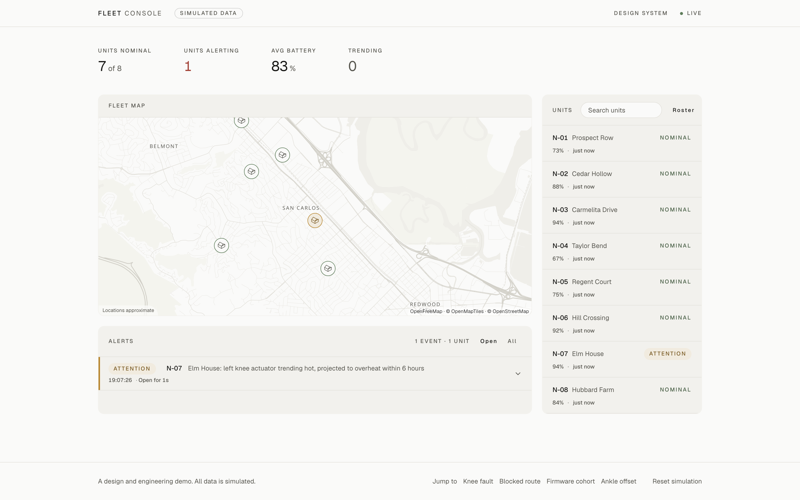
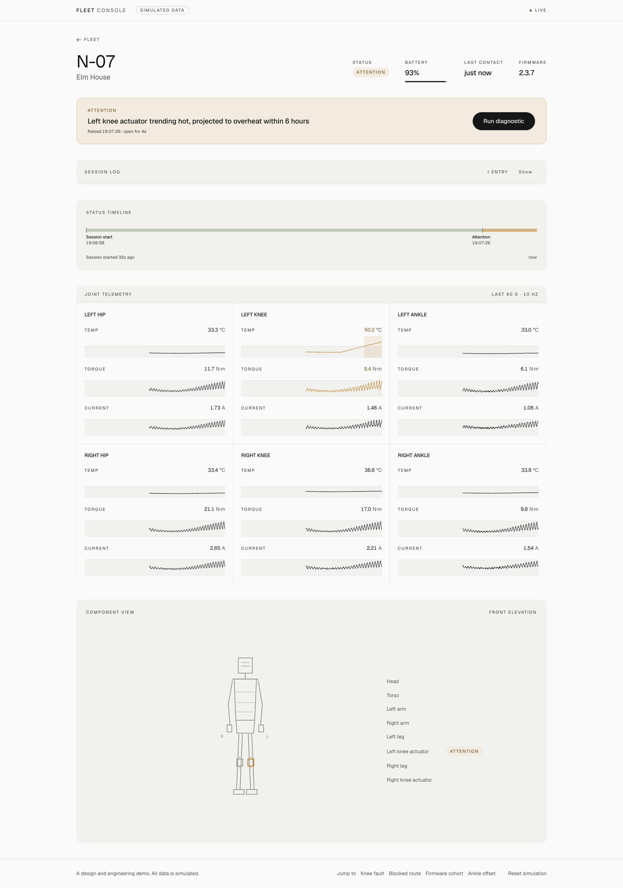
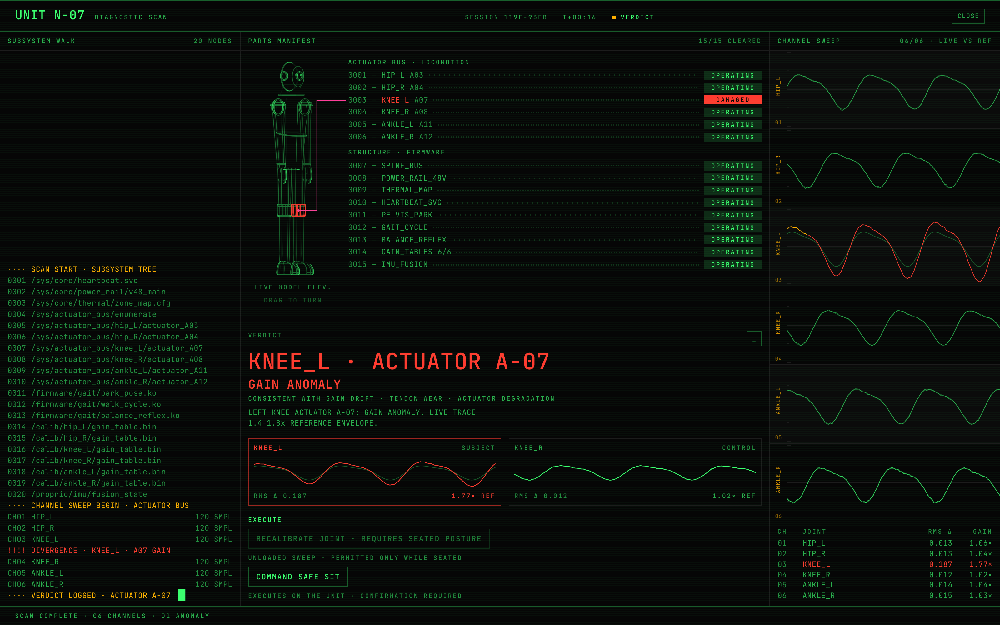
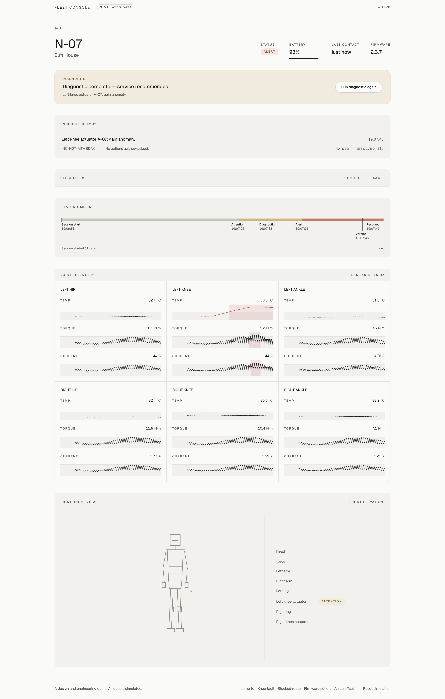
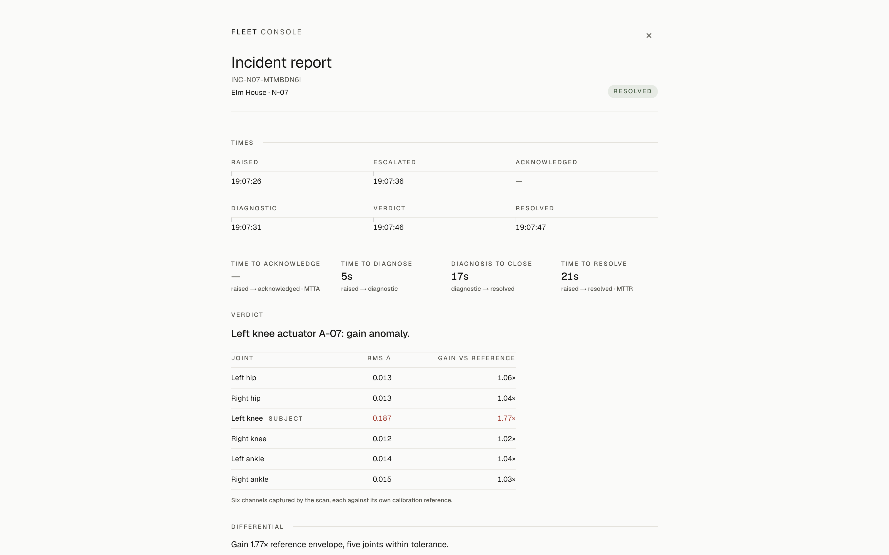

# Walkthrough — the demo in four acts

Open the [live demo](https://fleet-console.pages.dev) and leave it running.
Four storylines play on one shared clock: an escalation, a self-recovery,
a fleet-wide rollout, and a calibration that works. They run whether or not you are looking, and the whole
arc fits inside six minutes. Timings are from page load; _Reset simulation_
in the footer replays everything from the same seed.

**Or skip to the act you want.** _Jump to_ in the footer — _Knee fault_,
_Blocked route_, _Firmware cohort_, _Ankle offset_ — replays the run from the
top and stops eight seconds short of that act's first beat, so the alert still
arrives while you are watching and the fleet still carries everything that
would already have happened by then. Pressing the same act twice lands on the
same board both times.

## Act 1 — one robot, escalating (0:15 → 1:15)

The fleet is calm: eight units, a steady KPI band, and a `LIVE` chip in the
header that is the transport reporting its own state. At **0:15** the sim
starts heating N-07's left knee actuator and putting ripple in its torque.
Nothing alerts yet. At about **0:20** `TRENDING` ticks to 1 and N-07's rail row
names its suspect — _Trending · left knee +18 °C/min_ — while the unit still
reads nominal. That is the trend watch: a least-squares fit over the last
fifteen seconds of joint temperature, flagging the climb before the robot
complains.

At **0:28** `N-07 · Elm House` flips to `ATTENTION`. The map marker changes with
it and the alert feed gains a line: _left knee actuator trending hot, projected
to overheat within 6 hours_. The amber is a forecast read off the trend, not a
threshold trip. At **0:38** the unit goes red; the sim compresses the six-hour
curve into ten seconds so the forecast pays off on camera.

**Click N-07.** Eighteen live canvas instruments, three per joint. The left
knee's temperature sits well above every other joint and its torque and current
traces have gone ragged. **Press Run diagnostic** — the one black pill in the
product, and the only primary action on the page.

**The descent.** The operator page drains over 200 ms, a black surface wipes up
in 350 ms, and the type boots in phosphor mono. (`prefers-reduced-motion` swaps
the wipe for a crossfade.) Twenty subsystem nodes stream into the walk log,
fifteen parts report on the manifest, and six channels sweep live against their
factory reference — five track it, and `KNEE_L` visibly does not. Fifteen
seconds in, the verdict: `KNEE_L · ACTUATOR A-07 — GAIN ANOMALY`, with the
evidence underneath it — RMS Δ against the healthy control joint, gain against
the reference envelope.

The recommendations are deliberately not the same kind of object. **Command
safe sit** reaches the robot. **Recalibrate joint** reaches the robot, once it
is seated. **Dispatch service** records to the incident and goes no further.
**Disable joint** is inert until the unit is sitting, because disabling a
load-bearing knee while the robot stands on it drops the robot.

**Press Command safe sit, then CONFIRM.** The confirmation opens with ABORT
focused and states what the maneuver costs. The narration arrives from the wire
— `GAIT ARRESTED` → `CROUCH PHASE` → `TORQUE RAMP-DOWN` → `POSTURE SETTLED` —
and N-07 stays red, because broken-but-safe is the honest state.

**`ESC` to return.** Operator space comes back with the incident on file. The
banner reads _Diagnostic complete — service recommended_ and the component view
highlights the left knee actuator on the chassis. In incident history, press the
`INC-N07-…` reference for the full report: chronology, the RMS/gain table, the
waveform exhibits, and a print stylesheet, because it is what an operator hands
to a technician.

## Act 2 — the fleet handling itself (2:00 → 2:40)

Back on the fleet page, do nothing. At **2:00** N-03 halts on a blocked route
and raises its own amber — _navigation blocked — replanning around
obstruction_. At **2:40** it clears that alert itself: the row goes to
`Resolved · self-recovered`, the unit is restated nominal, the KPI recounts.
Zero operator action.

A console that treats every amber as an escalation teaches its operators to
ignore ambers. Most of what a fleet does, it does alone; the interface has to
make clear which is which.

## Act 3 — blast radius (3:00 → the 4:30 deadline)

At **3:00** N-02 raises a warning with no unit name in it — _Balance reflex
latency above threshold_ — and N-04, N-06 and N-08 raise the identical string
ten seconds apart. The third crossing at **3:20** makes it a cohort and a fleet
incident card takes the top of the page; by **3:30** it reads **4 units raising
the same warning**, with the canary comparison under it: _All on firmware 2.4.1
— 0 of 4 units on 2.3.7 affected_.

The card also names **N-05**, queued for the same firmware. **Press Halt
rollout** and confirm before **4:30**, when the install lands. The receipt is the
machine's own: `ROLLOUT HALTED — N-05 REMAINS ON 2.3.7`.

Halting saves the unit that has not been updated and does nothing for the four
already running the build, which the confirmation says out loud. **Press Roll
back cohort.** It runs serially, about four seconds per unit: each unit's
firmware returns to 2.3.7, its status goes nominal, its alert clears itself
(`Resolved · rollback`), and the cohort counts down and dissolves.

Hesitate past 4:30 and the install lands, N-05 raises the same warning at 4:40,
and the halt is refused with `NO ROLLOUT ACTIVE`. Halting late does not
un-install. Four units telling the same story, correlated by firmware, is the
pattern no single unit page could surface.

## Act 4 — the fault a calibration actually fixes (5:30)

N-01's right ankle encoder has a drifted zero. It has been wrong since the
first sample of the run, and a diagnostic on N-01 finds it at any time — the
trace has the right shape displaced from its reference, an *offset* rather
than the knee's *gain* fault. What waits until **5:30** is the unit's own
detector: gait asymmetry is a slow statistical estimate over many strides, so
the amber lands minutes after a thermal runaway would. It stays amber. Nothing
is getting worse, and an alert that climbed to red would be the sim inventing
urgency.

**Click N-01, run the diagnostic, command safe sit, then Recalibrate joint.**
Re-zeroing an encoder is exactly what a calibration is, so the ladder stops at
the remote rung: the trace returns to its reference, the alert clears with
`Resolved · recalibrated`, and nobody drives anywhere. On N-07 the same
command reports `PARTIAL`, because a rewritten gain table cannot fix tendon
wear. Two faults, one mechanism, two honest outcomes.
